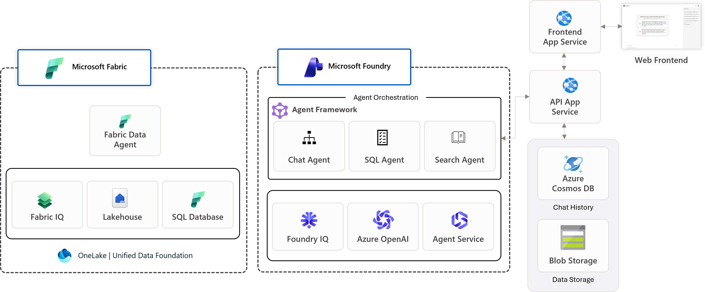

# Deploy solution

This step deploys the core infrastructure and runs the solution with a default scenario so you can see it working end-to-end.

## Architecture

<!-- TODO: Add architecture diagram image here -->

The solution combines Microsoft Fabric and Microsoft Foundry to create an AI solution that can answer questions using both structured data and unstructured documents:

- **Microsoft Fabric** provides the data layer with Lakehouse, Warehouse, and the Fabric IQ semantic layer for natural language to SQL translation
- **Microsoft Foundry** hosts the AI agents, including Foundry IQ for document retrieval and the Orchestrator Agent that orchestrates both capabilities
- **Azure AI Services** powers the language models (GPT-4o-mini) and embeddings
- **Azure AI Search** stores document vectors for semantic retrieval

!!! tip "Stuck? Ask Copilot"
    Use GitHub Copilot Chat (`Ctrl+I`) for help with errors.

---

[← Get Started](../00-get-started/workshop-flow.md) | [Deploy Azure resources →](01-deploy-azure.md)
